# <p align="center">Design-Patterns</p>
**<p align="center">Шаблоны проектирования</p>**

- [Поведенческие (Behavioral)](#Поведенческие-behavioral)
  - [Цепочка обязанностей (Chain Of Responsibilities)](#Цепочка-обязанностей)
  - [Команда (Command)](#Команда)
  - [Итератор (Iterator)](#Итератор)
  - [Посредник (Mediator)](#Посредник)
  - [Хранитель/Снимок (Momento)](#ХранительСнимок)
  - [Наблюдатель (Observer)](#Наблюдатель)
  - [Состояние (State)](#Состояние)
  - [Стратегия (Strategy)](#Стратегия)
  - [Шаблонный метод (TemplateMethod)](#Шаблонный-метод)
  - [Посетитель (Visitor)](#Посетитель)
- [Порождающие (Creational)](#Порождающие-creational)
  - [Абстрактная фабрика (AbstractFactory)](#Абстрактная-фабрика)
  - [Строитель (Builder)](#Строитель)
  - [Фабричный метод (FactoryMethod)](#Фабричный-метод)
  - [Прототип (Prototype)](#Прототип)
  - [Синглтон (Singleton)](#Синглтон)
- [Структурные (Structural)](#Структурные-structural)
  - [Адаптер (Adapter)](#Адаптер)
  - [Мост (Bridge)](#Мост)
  - [Компоновщик (Composite)](#Компоновщик)
  - [Декоратор (Decorator)](#Декоратор)
  - [Фасад (Facade)](#Фасад)
  - [Приспособленец/Легковес (FlyWeight)](#ПриспособленецЛегковес)
  - [Заместитель (Proxy)](#Заместитель)

---

## Поведенческие *[(Behavioral)](https://github.com/vovancho/design-patterns/tree/master/Behavioral)*

### Цепочка обязанностей

*[Chain Of Responsibilities](Behavioral/ChainOfResponsibilities.php)*

Позволяет передавать запрос по цепочке потенциальных обработчиков, пока один из них не обработает запрос.

#### Пример

HTTP Request Middleware ([PSR-15](https://www.php-fig.org/psr/psr-15/))

>  инверсия первоначального замысла паттерна. Действительно, в стандартной реализации запрос передаётся по цепочке только в том случае, если текущий обработчик НЕ МОЖЕТ его обработать, тогда как middleware передаёт запрос дальше по цепочке, когда считает, что приложение МОЖЕТ обработать запрос.

#### Признаки применения паттерна

Цепочку обязанностей можно определить по спискам обработчиков или проверок, через которые пропускаются запросы. Особенно если порядок следования обработчиков важен.

#### Отношения с другими паттернами

[Цепочка обязанностей](#Цепочка-обязанностей) передаёт запрос последовательно через цепочку потенциальных получателей, ожидая, что какой-то из них обработает запрос.

[Цепочка обязанностей](#Цепочка-обязанностей) и [Декоратор](#Декоратор) имеют похожие структуры.

Обработчики в [Цепочке обязанностей](#Цепочка-обязанностей) могут выполнять произвольные действия, независимые друг от друга, а также в любой момент прерывать дальнейшую передачу по цепочке. С другой стороны [Декораторы](#Декоратор) расширяют какое-то определённое действие, не ломая интерфейс базовой операции и не прерывая выполнение остальных декораторов.


```php
$nevrolog = new Nevrolog();
$kardiolog = new Kardiolog();
$nevrolog->goNextDoctor($kardiolog);
$nevrolog->cure('Болит голова');
$nevrolog->cure('Болит сердце');
$nevrolog->cure('Плохо вижу');

/**
 * php Behavioral/ChainOfResponsibilities.php
 *
 * Цепочка обязанностей
 *
 * Я врач Невролог, я вылечу, если у Вас 'Болит голова'.
 * ---
 * Я врач Невролог, я не могу Вас вылечить, если у Вас 'Болит сердце'. Я направлю Вас к врачу по специальности 'Кардиолог'.
 * Я врач Кардиолог, я вылечу, если у Вас 'Болит сердце'.
 * ---
 * Я врач Невролог, я не могу Вас вылечить, если у Вас 'Плохо вижу'. Я направлю Вас к врачу по специальности 'Кардиолог'.
 * Я врач Кардиолог, ничем не можем Вам помочь.
 */
```

### Команда

*[Command](Behavioral/Command.php)*

Позволяет заворачивать запросы или простые операции в отдельные объекты.

#### Пример

Паттерн можно часто встретить в PHP-коде, особенно когда нужно откладывать выполнение команд, выстраивать их в очереди, а также хранить историю и делать отмену.

#### Признаки применения паттерна

Классы команд построены вокруг одного действия и имеют очень узкий контекст. Объекты команд часто подаются в обработчики событий элементов GUI. Практически любая реализация отмены использует принципа команд.

#### Отношения с другими паттернами

[Команда](#Команда) устанавливает косвенную одностороннюю связь от отправителей к получателям.

[Команду](#Команда) и [Снимок](#ХранительСнимок) можно использовать сообща для реализации отмены операций.

[Команда](#Команда) и [Стратегия](#Стратегия) похожи по духу, но отличаются масштабом и применением:

 * [Команду](#Команда) используют, чтобы превратить любые разнородные действия в объекты. Параметры операции превращаются в поля объекта. Этот объект теперь можно логировать, хранить в истории для отмены, передавать во внешние сервисы и так далее.
 * С другой стороны, [Стратегия](#Стратегия) описывает разные способы произвести одно и то же действие, позволяя взаимозаменять эти способы в каком-то объекте контекста.

[Посетитель](#Посетитель) можно рассматривать как расширенный аналог [Команды](#Команда), который способен работать сразу с несколькими видами получателей.

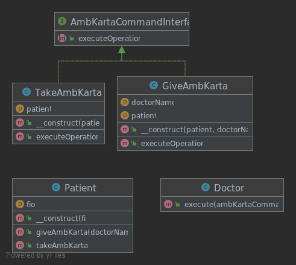

```php
$patient = new Patient('Иванов Иван Иванович');

$doctor = new Doctor();
$doctor->execute(new GiveAmbKarta($patient, 'Сидоров Сергей Петрович'));
$doctor->execute(new TakeAmbKarta($patient));

/**
 * php Behavioral/Command.php
 *
 * Команда
 *
 * Пациент 'Иванов Иван Иванович' передает амбулаторную карту врачу 'Сидоров Сергей Петрович'.
 * Пациент 'Иванов Иван Иванович' забирает амбулаторную карту у врача.
 */
```

### Итератор

*[Iterator](Behavioral/Iterator.php)*

Идея паттерна Итератор состоит в том, чтобы вынести поведение обхода коллекции из самой коллекции в отдельный класс.

PHP имеет встроенный интерфейс для поддержки итераторов (`\Iterator`), на основании которого можно строить свои Итераторы.

#### Пример

Обход дерева в глубину одним итератором, другим можно перемещаться по дереву в ширину.

Реализация разных способов обхода коллекций.

#### Признаки применения паттерна

Итератор легко определить по методам навигации (например, получения следующего/предыдущего элемента и т. д.) или по встроенному интерфейсу PHP `\Iterator`.

#### Отношения с другими паттернами

Вы можете обходить дерево [Компоновщика](#Компоновщик), используя [Итератор](#Итератор).

[Фабричный метод](#Фабричный-метод) можно использовать вместе с [Итератором](#Итератор), чтобы подклассы коллекций могли создавать подходящие им итераторы.

[Посетитель](#Посетитель) можно использовать совместно с [Итератором](#Итератор). [Итератор](#Итератор) будет отвечать за обход структуры данных, а [Посетитель](#Посетитель) — за выполнение действий над каждым её компонентом.

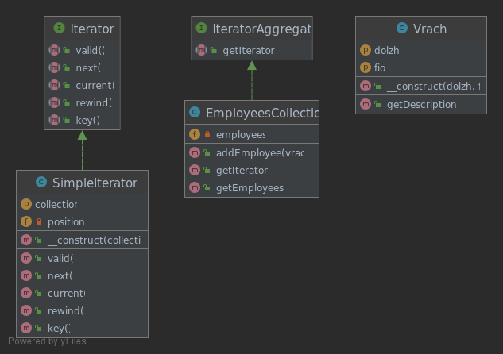

```php
$employees = new EmployeesCollection;
$employees->addEmployee(new Vrach('Невролог', 'Иванов Иван Иванович'));
$employees->addEmployee(new Vrach('Кардиолог', 'Петров Петр Петрович'));
$employees->addEmployee(new Vrach('Терапевт', 'Сидоров Сергей Сергеевич'));

/** @var Vrach $employee */
foreach ($employees->getIterator() as $employee) {
    echo $employee->getDescription();
}

/**
 * php Behavioral/Iterator.php
 *
 * Итератор
 *
 * Врач: Невролог, Иванов Иван Иванович
 * Врач: Кардиолог, Петров Петр Петрович
 * Врач: Терапевт, Сидоров Сергей Сергеевич
 */
```

### Посредник

*[Mediator](Behavioral/Mediator.php)*

Позволяет уменьшить связанность множества классов между собой, благодаря перемещению этих связей в один класс-посредник.

#### Пример

Примерами паттерна могут служить EventDispatcher-ы многих фреймворков, а также некоторые реализации контроллеров в MVC фреймворках.

#### Признаки применения паттерна

Классы скрывающие в себе все сложные связи и зависимости между классами отдельных компонентов программы.

#### Отношения с другими паттернами

[Посредник](#Посредник) убирает прямую связь между отправителями и получателями, заставляя их общаться опосредованно, через себя.

[Посредник](#Посредник) и [Фасад](#Фасад) похожи тем, что пытаются организовать работу множества существующих классов.
 * [Фасад](#Фасад) создаёт упрощённый интерфейс к подсистеме, не внося в неё никакой добавочной функциональности. Сама подсистема не знает о существовании [Фасада](#Фасад). Классы подсистемы общаются друг с другом напрямую.
 * [Посредник](#Посредник) централизует общение между компонентами системы. Компоненты системы знают только о существовании [Посредника](#Посредник), у них нет прямого доступа к другим компонентам.

Разница между [Посредником](#Посредник) и [Наблюдателем](#Наблюдатель) не всегда очевидна. Чаще всего они выступают как конкуренты, но иногда могут работать вместе.
 * Цель [Посредника](#Посредник) — убрать обоюдные зависимости между компонентами системы. Вместо этого они становятся зависимыми от самого посредника. С другой стороны, цель [Наблюдателя](#Наблюдатель) — обеспечить динамическую одностороннюю связь, в которой одни объекты косвенно зависят от других.
 * Довольно популярна реализация [Посредника](#Посредник) при помощи [Наблюдателя](#Наблюдатель). При этом объект посредника будет выступать издателем, а все остальные компоненты станут подписчиками и смогут динамически следить за событиями, происходящими в посреднике. В этом случае трудно понять, чем же отличаются оба паттерна.
 * Но [Посредник](#Посредник) имеет и другие реализации, когда отдельные компоненты жёстко привязаны к объекту посредника. Такой код вряд ли будет напоминать [Наблюдателя](#Наблюдатель), но всё же останется [Посредником](#Посредник).
 * Напротив, в случае реализации посредника с помощью [Наблюдателя](#Наблюдатель) представим такую программу, в которой каждый компонент системы становится издателем. Компоненты могут подписываться друг на друга, в то же время не привязываясь к конкретным классам. Программа будет состоять из целой сети [Наблюдателей](#Наблюдатель), не имея центрального объекта-[Посредника](#Посредник).

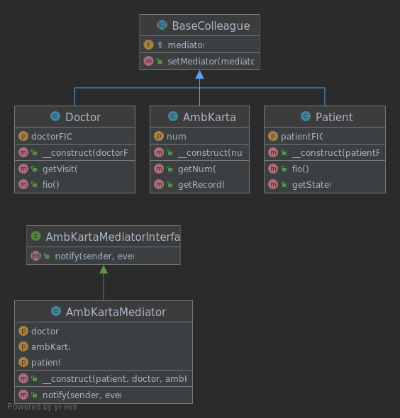

```php
$patient = new Patient('Иванов Иван Иванович'); // Коллега/Компонент
$doctor = new Doctor('Ефимов Ефим Ефимович'); // Коллега/Компонент
$ambKarta = new AmbKarta(1); // Коллега/Компонент

new AmbKartaMediator($patient, $doctor, $ambKarta); // Посредник между компонентами Patient, Doctor, AmbKarta

echo $patient->getState(); // метод оповещения посредника
echo PHP_EOL . PHP_EOL;
echo $doctor->getVisit(); // метод оповещения посредника
echo PHP_EOL . PHP_EOL;
echo $ambKarta->getRecord(); // метод оповещения посредника

/**
 * php Behavioral/Mediator.php
 *
 * Посредник
 *
 * Пациент посетил врача: Ефимов Ефим Ефимович
 *
 * Врач принял пациента: Иванов Иван Иванович
 *
 * Выписка из амбулаторной карты №1:
 * Пациент 'Иванов Иван Иванович' посетил врача 'Ефимов Ефим Ефимович'
 */
```

### Хранитель/Снимок

Позволяет делать снимки внутреннего состояния объектов, а затем восстанавливать их.

*[Momento](Behavioral/Momento.php)*

#### Пример

Снимки часто используют не только для реализации операции отмены, но и для транзакций, когда состояние объекта нужно «откатить», если операция не удалась.

В PHP чаще всего задачу хранения копии состояния можно решить куда проще при помощи сериализации.

#### Признаки применения паттерна

В случаях когда необходимо сделать действия отменяемыми. Для этого вам нужно сохранять текущее состояние перед тем, как выполнить любое действие. Если потом отменить действие, достанется копия состояния из истории и восстановится старое состояние.

#### Отношения с другими паттернами

[Снимок](#ХранительСнимок) можно использовать вместе с [Итератором](#Итератор), чтобы сохранить текущее состояние обхода структуры данных и вернуться к нему в будущем, если потребуется.

[Снимок](#ХранительСнимок) иногда можно заменить [Прототипом](#Прототип), если объект, состояние которого требуется сохранять в истории, довольно простой, не имеет активных ссылок на внешние ресурсы либо их можно легко восстановить.

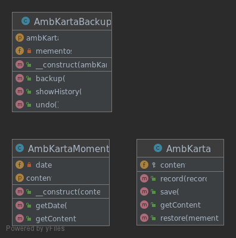

```php
$ambKartaBackup = new AmbKartaBackup($ambKarta = new AmbKarta());

$ambKarta->record('День 1: Пациент посетил врача невролога');
$ambKartaBackup->backup();

$ambKarta->record('День 2: Пациент посетил врача кардиолога');
$ambKartaBackup->backup();

echo '---- Текущее состояние ----' . PHP_EOL;
echo $ambKartaBackup->showHistory() . '----' . PHP_EOL . PHP_EOL;

$ambKartaBackup->undo();

echo '---- Текущее состояние после undo ----' . PHP_EOL;
echo $ambKartaBackup->showHistory() . '----' . PHP_EOL;

/**
 * Хранитель/Снимок
 *
 * ---- Текущее состояние ----
 * 2021-07-13T09:35:13+0000:
 * День 1: Пациент посетил врача невролога
 *
 * 2021-07-13T09:35:13+0000:
 * День 1: Пациент посетил врача невролога
 * День 2: Пациент посетил врача кардиолога
 * ----
 *
 * ---- Текущее состояние после undo ----
 * 2021-07-13T09:35:13+0000:
 * День 1: Пациент посетил врача невролога
 * ----
 */
```

### Наблюдатель

Создаёт механизм подписки, позволяющий одним объектам следить и реагировать на события, происходящие в других объектах.

*[Observer](Behavioral/Observer.php)*

#### Пример

PHP имеет несколько встроенных интерфейсов (`\SplSubject`, `\SplObserver`), на которых можно строить свои реализации Наблюдателя.

#### Признаки применения паттерна

Наблюдатель можно определить по механизму подписки и методам оповещения, которые вызывают компоненты программы.

#### Отношения с другими паттернами

[Наблюдатель](#Наблюдатель) передаёт запрос одновременно всем заинтересованным получателям, но позволяет им динамически подписываться или отписываться от таких оповещений.

Разница между [Посредником](#Посредник) и [Наблюдателем](#Наблюдатель) не всегда очевидна. Чаще всего они выступают как конкуренты, но иногда могут работать вместе.
* Цель [Посредника](#Посредник) — убрать обоюдные зависимости между компонентами системы. Вместо этого они становятся зависимыми от самого посредника. С другой стороны, цель [Наблюдателя](#Наблюдатель) — обеспечить динамическую одностороннюю связь, в которой одни объекты косвенно зависят от других.
* Довольно популярна реализация [Посредника](#Посредник) при помощи [Наблюдателя](#Наблюдатель). При этом объект посредника будет выступать издателем, а все остальные компоненты станут подписчиками и смогут динамически следить за событиями, происходящими в посреднике. В этом случае трудно понять, чем же отличаются оба паттерна.
* Но [Посредник](#Посредник) имеет и другие реализации, когда отдельные компоненты жёстко привязаны к объекту посредника. Такой код вряд ли будет напоминать [Наблюдателя](#Наблюдатель), но всё же останется [Посредником](#Посредник).
* Напротив, в случае реализации посредника с помощью [Наблюдателя](#Наблюдатель) представим такую программу, в которой каждый компонент системы становится издателем. Компоненты могут подписываться друг на друга, в то же время не привязываясь к конкретным классам. Программа будет состоять из целой сети [Наблюдателей](#Наблюдатель), не имея центрального объекта-[Посредника](#Посредник).

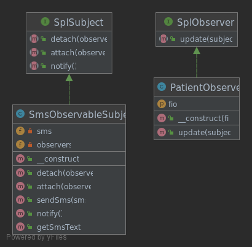

```php
$patientObserver1 = new PatientObserver('Иванов Иван Иванович');
$patientObserver2 = new PatientObserver('Петров Петр Петрович');

$smsObservableSubject = new SmsObservableSubject();
$smsObservableSubject->attach($patientObserver1);
$smsObservableSubject->attach($patientObserver2);

$smsObservableSubject->sendSms('В поликлинике день открытых дверей в эти выходные.');

echo '----------------' . PHP_EOL;

$smsObservableSubject->sendSms('Не забудьте пройти диспансеризацию в этом году.');

/**
 * php Behavioral/Observer.php
 *
 * Наблюдатель
 *
 * Пациент "Иванов Иван Иванович" получил sms сообщение с текстом "В поликлинике день открытых дверей в эти выходные."
 * Пациент "Петров Петр Петрович" получил sms сообщение с текстом "В поликлинике день открытых дверей в эти выходные."
 * ----------------
 * Пациент "Иванов Иван Иванович" получил sms сообщение с текстом "Не забудьте пройти диспансеризацию в этом году."
 * Пациент "Петров Петр Петрович" получил sms сообщение с текстом "Не забудьте пройти диспансеризацию в этом году."
 */
```

### Состояние

Позволяет объектам менять поведение в зависимости от своего состояния. Извне создаётся впечатление, что изменился класс объекта.

*[State](Behavioral/State.php)*

#### Пример

Паттерн Состояние иногда используют в PHP для превращения громоздких стейт-машин, построенных на операторах switch, в объекты.

#### Признаки применения паттерна

Методы класса делегируют работу одному вложенному объекту.

#### Отношения с другими паттернами

[Состояние](#Состояние) можно рассматривать как надстройку над [Стратегией](#Стратегия). Оба паттерна используют композицию, чтобы менять поведение основного объекта, делегируя работу вложенным объектам-помощникам. Однако в [Стратегии](#Стратегия) эти объекты не знают друг о друге и никак не связаны. В [Состоянии](#Состояние) сами конкретные состояния могут переключать контекст.


```php
$patient1 = new Patient(new EnteredPatientState());
echo 'Здоровье пациента 1: ' . ($patient1->isRecovered() ? 'Здоров' : 'Не здоров') . PHP_EOL;
$patient1->toHeal();
echo 'Здоровье пациента 1: ' . ($patient1->isRecovered() ? 'Здоров' : 'Не здоров') . PHP_EOL;
$patient1->toHeal();
echo 'Здоровье пациента 1: ' . ($patient1->isRecovered() ? 'Здоров' : 'Не здоров') . PHP_EOL;

echo PHP_EOL;

$patient2 = new Patient(new TreatedPatientState());
echo 'Здоровье пациента 2: ' . ($patient2->isRecovered() ? 'Здоров' : 'Не здоров') . PHP_EOL;
$patient2->toHeal();
echo 'Здоровье пациента 2: ' . ($patient2->isRecovered() ? 'Здоров' : 'Не здоров') . PHP_EOL;

/**
 * php Behavioral/State.php
 *
 * Состояние
 *
 * Здоровье пациента 1: Не здоров
 * Здоровье пациента 1: Не здоров
 * Здоровье пациента 1: Здоров
 *
 * Здоровье пациента 2: Не здоров
 * Здоровье пациента 2: Здоров
 */

```

### Стратегия

Определяет семейство схожих алгоритмов и помещает каждый из них в собственный класс, после чего алгоритмы можно взаимозаменять прямо во время исполнения программы.

*[Strategy](Behavioral/Strategy.php)*

#### Пример

Стратегию часто используют, где нужно подменять алгоритм во время выполнения программы. Но у паттерна есть довольно сильный конкурент в лице анонимных функций.

#### Признаки применения паттерна

Класс делегирует выполнение вложенному объекту абстрактного типа или интерфейса.

#### Отношения с другими паттернами

[Команда](#Команда) и [Стратегия](#Стратегия) похожи по духу, но отличаются масштабом и применением:

* [Команду](#Команда) используют, чтобы превратить любые разнородные действия в объекты. Параметры операции превращаются в поля объекта. Этот объект теперь можно логировать, хранить в истории для отмены, передавать во внешние сервисы и так далее.
* С другой стороны, [Стратегия](#Стратегия) описывает разные способы произвести одно и то же действие, позволяя взаимозаменять эти способы в каком-то объекте контекста.

[Стратегия](#Стратегия) меняет поведение объекта «изнутри», а [Декоратор](#Декоратор) изменяет его «снаружи».

[Шаблонный метод](#Шаблонный-метод) использует наследование, чтобы расширять части алгоритма. [Стратегия](#Стратегия) использует делегирование, чтобы изменять выполняемые алгоритмы на лету.

[Состояние](#Состояние) можно рассматривать как надстройку над [Стратегией](#Стратегия). Оба паттерна используют композицию, чтобы менять поведение основного объекта, делегируя работу вложенным объектам-помощникам. Однако в [Стратегии](#Стратегия) эти объекты не знают друг о друге и никак не связаны. В [Состоянии](#Состояние) сами конкретные состояния могут переключать контекст.

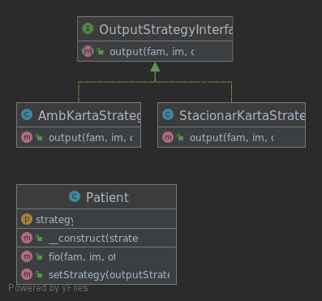

```php
$outputAmbKarta = new AmbKartaStrategy();
$outputStacionar = new StacionarKartaStrategy();

$patient = new Patient($outputAmbKarta);

[$fam, $im, $ot] = $patient->fio('Иванов', 'Иван', 'Иванович');
echo "Амбулаторная карта пациента: $fam $im $ot" . PHP_EOL;

$patient->setStrategy($outputStacionar);
[$fio] = $patient->fio('Петров', 'Петр', 'Петрович');
echo "Стационарная карта пациента: $fio" . PHP_EOL;

/**
 * php Behavioral/Strategy.php
 *
 * Стратегия
 *
 * Амбулаторная карта пациента: Иванов Иван Иванович
 * Стационарная карта пациента: Петров Петр Петрович
 */
```

### Шаблонный метод
*[TemplateMethod](Behavioral/TemplateMethod.php)*

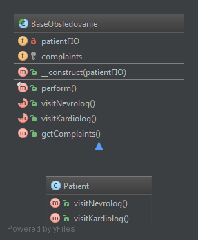

```php
$patient = new Patient('Иванов Иван Иванович');
$patient->perform();

/**
 * php Behavioral/TemplateMethod.php
 * шаблонный метод
 * У пациента Иванов Иван Иванович умеются жалобы:
 * Болит голова
 * Болит сердце
 */
```

### Посетитель
*[Visitor](Behavioral/Visitor.php)*

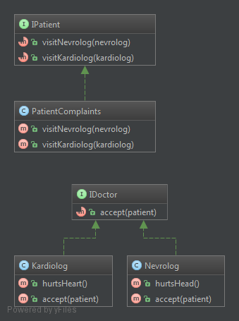

```php
$nevrolog = new Nevrolog();
$kardiolog = new Kardiolog();

$patientComplaints = new PatientComplaints();

echo "Я врач невролог, пациент жалуется, что у него:" . PHP_EOL;
$nevrolog->accept($patientComplaints);
echo "Я врач кардиолог, пациент жалуется, что у него:" . PHP_EOL;
$kardiolog->accept($patientComplaints);

/**
 * php Behavioral/Visitor.php
 * Посетитель
 * Я врач невролог, пациент жалуется, что у него:
 * Болит голова
 * Я врач кардиолог, пациент жалуется, что у него:
 * Болит сердце
 */
```

## Порождающие *[(Creational)](https://github.com/vovancho/design-patterns/tree/master/Creational)*

### Абстрактная фабрика
*[AbstractFactory](Creational/AbstractFactory.php)*


```php
$factoryNevrolog = new NevrologFactory();
$patient1 = $factoryNevrolog->createPatient('Петров Петр Петрович');
$zakluchenie1 = $factoryNevrolog->createZakluchenie('Иванов Иван Иванович');
echo $patient1->fio();
echo $zakluchenie1->result();

$factoryKardiolog = new KardiologFactory();
$patient2 = $factoryKardiolog->createPatient('Бобров Сергей Иванович');
$zakluchenie2 = $factoryKardiolog->createZakluchenie('Сидоров Петр Петрович');
echo $patient2->fio();
echo $zakluchenie2->result();

/**
 * php Creational/AbstractFactory.php
 * Абстрактная фабрика
 * Пациент неврлога: Петров Петр Петрович
 * Вы посетили врача-невролога 'Иванов Иван Иванович'
 * Пациент кардиолога: Бобров Сергей Иванович
 * Вы посетили врача-кардиолога 'Сидоров Петр Петрович'
 */
```

### Строитель
*[Builder](Creational/Builder.php)*

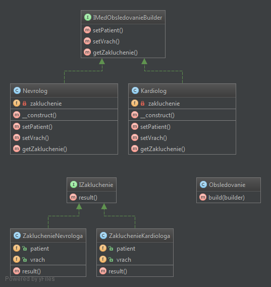

```php
$obsledovanie1 = new Obsledovanie();
$zaklucheniePatient1 = $obsledovanie1->build(new Nevrolog());
echo $zaklucheniePatient1->result();

$obsledovanie2 = new Obsledovanie();
$zaklucheniePatient2 = $obsledovanie2->build(new Kardiolog());
echo $zaklucheniePatient2->result();

/**
 * php Creational/Builder.php
 * Строитель
 * Пациент: Петров Петр Петрович
 * Вы посетили врача-невролога 'Иванов Иван Иванович'
 * Пациент: Бобров Сергей Иванович
 * Вы посетили врача-кардиолога 'Сидоров Петр Петрович'
 */
```

### Фабричный метод
*[FactoryMethod](Creational/FactoryMethod.php)*

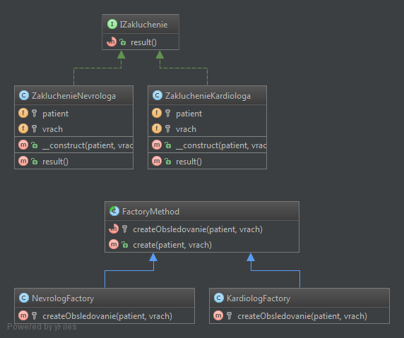

```php
$obsledovanieNevrolog = new NevrologFactory();
$zakluchenieNevrolog = $obsledovanieNevrolog->create('Петров Петр Петрович', 'Иванов Иван Иванович');
echo $zakluchenieNevrolog->result();

$obsledovanieKardiolog = new KardiologFactory();
$zakluchenieKardiolog = $obsledovanieKardiolog->create('Бобров Сергей Иванович', 'Сидоров Петр Петрович');
echo $zakluchenieKardiolog->result();

/**
 * php Creational/FactoryMethod.php
 * Фабричный метод
 * Пациент: Петров Петр Петрович
 * Вы посетили врача-невролога 'Иванов Иван Иванович'
 * Пациент: Бобров Сергей Иванович
 * Вы посетили врача-кардиолога 'Сидоров Петр Петрович'
 */
```

### Прототип
*[Prototype](Creational/Prototype.php)*

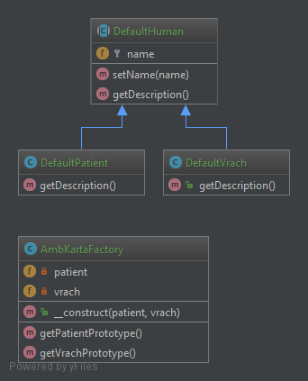

```php
$ambKartaFactory = new AmbKartaFactory(
    $defaultPatient = new DefaultPatient,
    $defaultVrach = new DefaultVrach
);

$prototypePatient = $ambKartaFactory->getPatientPrototype();
$prototypePatient->setName('Иванов Иван Иванович');
$prototypeVrach = $ambKartaFactory->getVrachPrototype();
$prototypeVrach->setName('Петров Петр Петрович');

echo $defaultPatient->getDescription();
echo $defaultVrach->getDescription();
echo '-----------------' . PHP_EOL;
echo $prototypePatient->getDescription();
echo $prototypeVrach->getDescription();

/**
 * php Creational/Prototype.php
 * Прототип
 * Пациент: не задано
 * Врач: не задано
 * -----------------
 * Пациент: Иванов Иван Иванович
 * Врач: Петров Петр Петрович
 */
```

### Синглтон
*[Singleton](Creational/Singleton.php)*

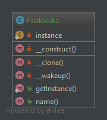

```php
echo Poliklinika::getInstance()->name();

/**
 * php Creational/Singleton.php
 * Синглтон
 * Поликлиника №1
 */
```

## Структурные *[(Structural)](https://github.com/vovancho/design-patterns/tree/master/Structural)*

### Адаптер
*[Adapter](Structural/Adapter.php)*

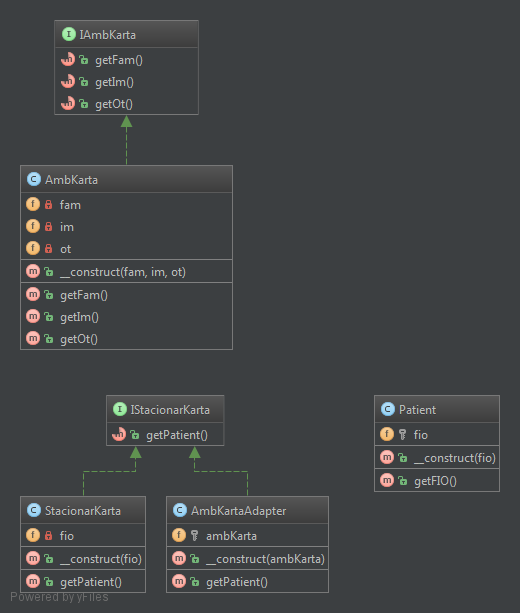

```php
$stacionarKarta = new StacionarKarta('Иванов Иван Иванович');
echo "Стационарная карта пациента:" . PHP_EOL;
echo $stacionarKarta->getPatient()->getFIO() . PHP_EOL;

$ambKarta = new AmbKarta('Петров', 'Петр', 'Петрович');
$ambKartaToStacionarKarta = new AmbKartaAdapter($ambKarta);
echo "Стационарная карта пациента из амбулаторной карты:" . PHP_EOL;
echo $ambKartaToStacionarKarta->getPatient()->getFIO() . PHP_EOL;

/**
 * php Structural/Adapter.php
 * Адаптер
 * Стационарная карта пациента:
 * Иванов Иван Иванович
 * Стационарная карта пациента из амбулаторной карты:
 * Петров Петр Петрович
 */
```

### Мост
*[Bridge](Structural/Bridge.php)*

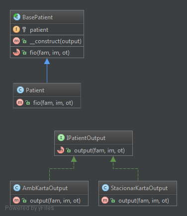

```php
$outputAmbKarta = new AmbKartaOutput();
$outputStacionar = new StacionarKartaOutput();

$patientAmbKarta = new Patient($outputAmbKarta);
$patientStacionar = new Patient($outputStacionar);

list($fam, $im, $ot) = $patientAmbKarta->fio('Иванов', 'Иван', 'Иванович');
echo "Амбулаторная карта пациента: $fam $im $ot" . PHP_EOL;

list($fio) = $patientStacionar->fio('Петров', 'Петр', 'Петрович');
echo "Стационарная карта пациента: $fio" . PHP_EOL;

/**
 * php Structural/Bridge.php
 * Мост
 * Амбулаторная карта пациента: Иванов Иван Иванович
 * Стационарная карта пациента: Петров Петр Петрович
 */
```

### Компоновщик
*[Composite](Structural/Composite.php)*

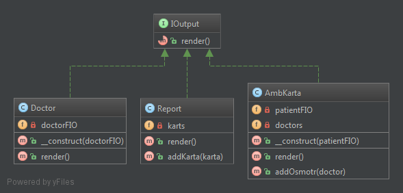

```php
$patientAmbKarta1 = new AmbKarta('Иванов Иван Иванович');
$patientAmbKarta1->addOsmotr(new Doctor('Сидоров Николай Николаевич'));
$patientAmbKarta1->addOsmotr(new Doctor('Гоголь Мария Ивановна'));

$patientAmbKarta2 = new AmbKarta('Петров Петр Петрович');
$patientAmbKarta2->addOsmotr(new Doctor('Фоменко Николай Сергеевич'));

$report = new Report();
$report->addKarta($patientAmbKarta1);
$report->addKarta($patientAmbKarta2);
$report->render();

/**
 * php Structural/Composite.php
 * Компоновщик
 * Отчет на дату: 14.03.2018
 *
 * ---Амбулаторная карта---
 * Пациента осмотрел врач: Сидоров Николай Николаевич
 * Пациента осмотрел врач: Гоголь Мария Ивановна
 * ------------------------
 *
 * ---Амбулаторная карта---
 * Пациента осмотрел врач: Фоменко Николай Сергеевич
 * ------------------------
 */
```

### Декоратор
*[Decorator](Structural/Decorator.php)*

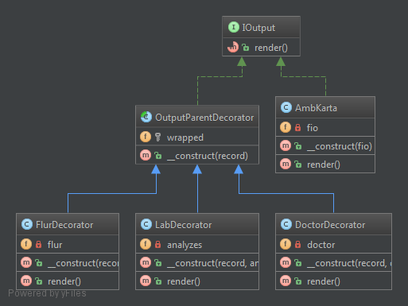

```php
echo "-----Амбулаторная карта-----" . PHP_EOL;

$ambKarta = new AmbKarta('Иванов Иван Иванович'); // Родитель всех Декораторов

$ambKarta = new DoctorDecorator($ambKarta, 'Сидоров Сергей Петрович'); // Декоратор
$ambKarta = new LabDecorator($ambKarta, ['Глюкоза: 12', 'Креатинин: 5', 'Белок: 7']); // Декоратор
$ambKarta = new FlurDecorator($ambKarta, true); // Декоратор
$ambKarta = new DoctorDecorator($ambKarta, 'Петров Петр Петрович'); // Декоратор

echo $ambKarta->render();

echo "----------------------------" . PHP_EOL;

/**
 * php Structural/Decorator.php
 * Декоратор
 * -----Амбулаторная карта-----
 * Пациент: Иванов Иван Иванович
 * Посетил врача: Сидоров Сергей Петрович
 * Результат анализов: Глюкоза: 12, Креатинин: 5, Белок: 7
 * Результат флюрографии: Флюрография пройдена
 * Посетил врача: Петров Петр Петрович
 * ----------------------------
 */
```

### Фасад
*[Facade](Structural/Facade.php)*

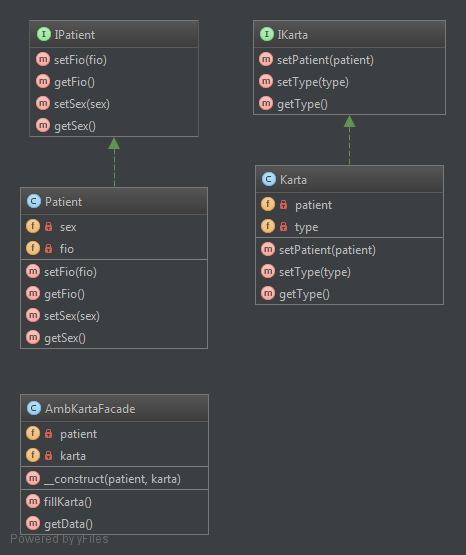

```php
$ambKarta = new AmbKartaFacade(new Patient(), new Karta());
$ambKarta->fillKarta();
echo $ambKarta->getData();

/**
 * php Structural/Facade.php
 * Фасад
 * Тип карты: Амбулаторная
 * Пациент: Иванов Иван Иванович
 * Пол: Мужчина
 */
```

### Приспособленец/Легковес
*[FlyWeight](Structural/FlyWeight.php)*

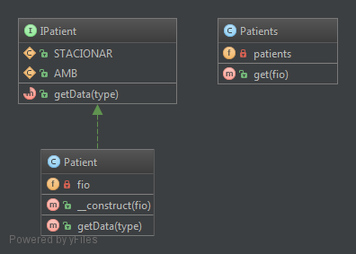

```php
$patientsFactory = new Patients();

$patients = [
    'Иванов Иван Иванович',
    'Петров Петр Петрович',
    'Иванов Иван Иванович',
    'Сидоров Николай Ефимович',
];

foreach ($patients as $patientFIO) { // Пациенты кэшируются (т.к. имеют внутреннее состояние)
    foreach ([IPatient::AMB, IPatient::STACIONAR] as $typeKart) { // Здесь передается внешее состояние
        $patientFromFlyweight = $patientsFactory->get($patientFIO);
        echo $patientFromFlyweight->getData($typeKart);
    }
}

/**
 * php Structural/FlyWeight.php
 * Приспособленец/Легковес
 * Тип карты: Амбулаторная
 * Пациент: Иванов Иван Иванович
 * Тип карты: Стационарная
 * Пациент: Иванов Иван Иванович
 * Тип карты: Амбулаторная
 * Пациент: Петров Петр Петрович
 * Тип карты: Стационарная
 * Пациент: Петров Петр Петрович
 * Тип карты: Амбулаторная
 * Пациент: Иванов Иван Иванович
 * Тип карты: Стационарная
 * Пациент: Иванов Иван Иванович
 * Тип карты: Амбулаторная
 * Пациент: Сидоров Николай Ефимович
 * Тип карты: Стационарная
 * Пациент: Сидоров Николай Ефимович
 */
```

### Заместитель
*[Proxy](Structural/Proxy.php)*

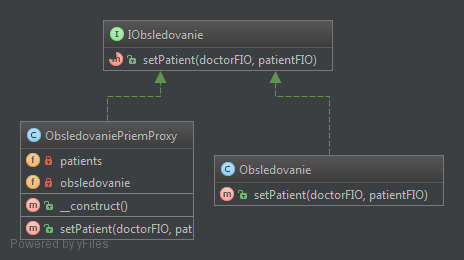

```php
$obsledovaniePriemProxy = new ObsledovaniePriemProxy();

$obsledovaniePriemProxy->setPatient('Сидоров Иван Иванович', 'Петров Петр Петрович'); // Первичный
$obsledovaniePriemProxy->setPatient('Сидоров Иван Иванович', 'Петров Петр Петрович'); // Вторичный
$obsledovaniePriemProxy->setPatient('Сидоров Сергей Ефимович', 'Иванов Иван Иванович'); // Первичный

/**
 * php Structural/Proxy.php
 * Заместитель
 * Пациент 'Петров Петр Петрович' пришел на прием к врачу 'Сидоров Иван Иванович'
 * Тип приема: Первичный.
 * Пациент 'Петров Петр Петрович' пришел на прием к врачу 'Сидоров Иван Иванович'
 * Тип приема: Вторичный.
 * Пациент 'Иванов Иван Иванович' пришел на прием к врачу 'Сидоров Сергей Ефимович'
 * Тип приема: Первичный.
 */
```
