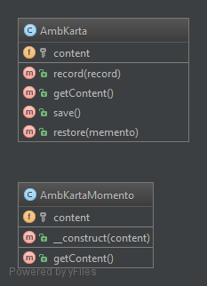
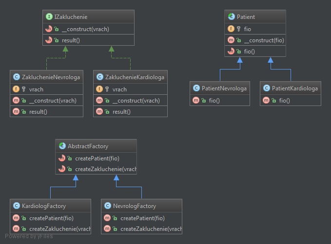

# <p align="center">Design-Patterns</p>
**<p align="center">Шаблоны проектирования</p>**

- [Поведенческие (Behavioral)](#Поведенческие-behavioral)
  - [Цепочка обязанностей (Chain Of Responsibilities)](#Цепочка-обязанностей)
  - [Команда (Command)](#Команда)
  - [Итератор (Iterator)](#Итератор)
  - [Посредник (Mediator)](#Посредник)
  - [Хранитель/Снимок (Momento)](#ХранительСнимок)
  - [Наблюдатель (Observer)](#Наблюдатель)
  - [Состояние (State)](#Состояние)
  - [Стратегия (Strategy)](#Стратегия)
  - [Шаблонный метод (TemplateMethod)](#Шаблонный-метод)
  - [Посетитель (Visitor)](#Посетитель)
- [Порождающие (Creational)](#Порождающие-creational)
  - [Абстрактная фабрика (AbstractFactory)](#Абстрактная-фабрика)
  - [Строитель (Builder)](#Строитель)
  - [Фабричный метод (FactoryMethod)](#Фабричный-метод)
  - [Прототип (Prototype)](#Прототип)
  - [Синглтон (Singleton)](#Синглтон)
- [Структурные (Structural)](#Структурные-structural)
  - [Адаптер (Adapter)](#Адаптер)
  - [Мост (Bridge)](#Мост)
  - [Компоновщик (Composite)](#Компоновщик)
  - [Декоратор (Decorator)](#Декоратор)
  - [Фасад (Facade)](#Фасад)
  - [Приспособленец/Легковес (FlyWeight)](#ПриспособленецЛегковес)
  - [Заместитель (Proxy)](#Заместитель)

---

## Поведенческие *[(Behavioral)](https://github.com/vovancho/design-patterns/tree/master/Behavioral)*

### Цепочка обязанностей

*[Chain Of Responsibilities](Behavioral/ChainOfResponsibilities.php)*

Позволяет передавать запрос по цепочке потенциальных обработчиков, пока один из них не обработает запрос.

#### Пример

HTTP Request Middleware ([PSR-15](https://www.php-fig.org/psr/psr-15/))

>  инверсия первоначального замысла паттерна. Действительно, в стандартной реализации запрос передаётся по цепочке только в том случае, если текущий обработчик НЕ МОЖЕТ его обработать, тогда как middleware передаёт запрос дальше по цепочке, когда считает, что приложение МОЖЕТ обработать запрос.

#### Признаки применения паттерна

Цепочку обязанностей можно определить по спискам обработчиков или проверок, через которые пропускаются запросы. Особенно если порядок следования обработчиков важен.

#### Отношения с другими паттернами

[Цепочка обязанностей](#Цепочка-обязанностей) и [Декоратор](#Декоратор) имеют похожие структуры.

Обработчики в [Цепочке обязанностей](#Цепочка-обязанностей) могут выполнять произвольные действия, независимые друг от друга, а также в любой момент прерывать дальнейшую передачу по цепочке. С другой стороны [Декораторы](#Декоратор) расширяют какое-то определённое действие, не ломая интерфейс базовой операции и не прерывая выполнение остальных декораторов.


```php
$nevrolog = new Nevrolog();
$kardiolog = new Kardiolog();
$nevrolog->goNextDoctor($kardiolog);
$nevrolog->cure('Болит голова');
$nevrolog->cure('Болит сердце');
$nevrolog->cure('Плохо вижу');

/**
 * php Behavioral/ChainOfResponsibilities.php
 *
 * Цепочка обязанностей
 *
 * Я врач Невролог, я вылечу, если у Вас 'Болит голова'.
 * ---
 * Я врач Невролог, я не могу Вас вылечить, если у Вас 'Болит сердце'. Я направлю Вас к врачу по специальности 'Кардиолог'.
 * Я врач Кардиолог, я вылечу, если у Вас 'Болит сердце'.
 * ---
 * Я врач Невролог, я не могу Вас вылечить, если у Вас 'Плохо вижу'. Я направлю Вас к врачу по специальности 'Кардиолог'.
 * Я врач Кардиолог, ничем не можем Вам помочь.
 */
```

### Команда

*[Command](Behavioral/Command.php)*

Позволяет заворачивать запросы или простые операции в отдельные объекты.

#### Пример

Паттерн можно часто встретить в PHP-коде, особенно когда нужно откладывать выполнение команд, выстраивать их в очереди, а также хранить историю и делать отмену.

#### Признаки применения паттерна

Классы команд построены вокруг одного действия и имеют очень узкий контекст. Объекты команд часто подаются в обработчики событий элементов GUI. Практически любая реализация отмены использует принципа команд.

#### Отношения с другими паттернами

[Команду](#Команда) и [Снимок](#ХранительСнимок) можно использовать сообща для реализации отмены операций.

[Команда](#Команда) и [Стратегия](#Стратегия) похожи по духу, но отличаются масштабом и применением:

 * [Команду](#Команда) используют, чтобы превратить любые разнородные действия в объекты. Параметры операции превращаются в поля объекта. Этот объект теперь можно логировать, хранить в истории для отмены, передавать во внешние сервисы и так далее.
 * С другой стороны, [Стратегия](#Стратегия) описывает разные способы произвести одно и то же действие, позволяя взаимозаменять эти способы в каком-то объекте контекста.

[Посетитель](#Посетитель) можно рассматривать как расширенный аналог [Команды](#Команда), который способен работать сразу с несколькими видами получателей.


```php
$patient = new Patient('Иванов Иван Иванович');

$doctor = new Doctor();
$doctor->execute(new GiveAmbKarta($patient, 'Сидоров Сергей Петрович'));
$doctor->execute(new TakeAmbKarta($patient));

/**
 * php Behavioral/Command.php
 *
 * Команда
 *
 * Пациент 'Иванов Иван Иванович' передает амбулаторную карту врачу 'Сидоров Сергей Петрович'.
 * Пациент 'Иванов Иван Иванович' забирает амбулаторную карту у врача.
 */
```

### Итератор
*[Iterator](Behavioral/Iterator.php)*


```php
$vrach1 = new Vrach('Невролог', 'Иванов Иван Иванович');
$vrach2 = new Vrach('Кардиолог', 'Петров Петр Петрович');
$vrach3 = new Vrach('Терапевт', 'Сидоров Сергей Сергеевич');

$employees = new Employees;
$employees->addEmployee($vrach1);
$employees->addEmployee($vrach2);
$employees->addEmployee($vrach3);

echo 'Количество сотрулников: ' . count($employees) . PHP_EOL;
/** @var Vrach $employee */
foreach ($employees as $employee) {
    echo $employee->getDescription();
}

$employees->removeEmployee($vrach2);
echo 'Количество сотрулников после исключения 1-го врача: ' . count($employees) . PHP_EOL;

/**
 * php Behavioral/Iterator.php
 * Итератор
 * Количество сотрулников: 3
 * Врач: Невролог, Иванов Иван Иванович
 * Врач: Кардиолог, Петров Петр Петрович
 * Врач: Терапевт, Сидоров Сергей Сергеевич
 * Количество сотрулников после исключения 1-го врача: 2
 */
```

### Посредник
*[Mediator](Behavioral/Mediator.php)*


```php
$patient = new Patient('Иванов Иван Иванович'); // Коллега/Компонент
$doctor = new Doctor('Ефимов Ефим Ефимович'); // Коллега/Компонент
$ambKarta = new AmbKarta(1); // Коллега/Компонент

new AmbKartaMediator($patient, $doctor, $ambKarta); // Посредник между компонентами Patient, Doctor, AmbKarta

$ambKarta->getRecord(); // метод оповещения посредника

/**
 * php Behavioral/Mediator.php
 * Посредник
 * Выписка из амбулаторной карты №1:
 * Пациент 'Иванов Иван Иванович' посетил врача 'Ефимов Ефим Ефимович'
 */
```

### Хранитель/Снимок
*[Momento](Behavioral/Momento.php)*



```php
$day1_AmbKarta = new AmbKarta();
$day1_AmbKarta->record('День 1: Пациент посетил врача невролога');
$registratura = $day1_AmbKarta->save();

$day2_AmbKarta = new AmbKarta();
$day2_AmbKarta->restore($registratura); // Восстанавливаем состояние карты от первого дня
$day2_AmbKarta->record('День 2: Пациент посетил врача кардиолога');

echo $day2_AmbKarta->getContent();

/**
 * php Behavioral/Momento.php
 * Хранитель/Снимок
 * День 1: Пациент посетил врача невролога
 * День 2: Пациент посетил врача кардиолога
 */
```

### Наблюдатель
*[Observer](Behavioral/Observer.php)*


```php
$patientObserver1 = new PatientObserver('Иванов Иван Иванович');
$patientObserver2 = new PatientObserver('Петров Петр Петрович');

$smsObservableSubject = new SmsObservableSubject(new Sms('В поликлинике день открытых дверей в эти выходные.'));
$smsObservableSubject->attach($patientObserver1);
$smsObservableSubject->attach($patientObserver2);

$smsObservableSubject->notify();

echo '----------------' . PHP_EOL;

$smsObservableSubject->changeSms(new Sms('Не забудьте пройти диспансеризацию в этом году.'));
$smsObservableSubject->notify();

/**
 * php Behavioral/Observer.php
 * Наблюдатель
 * Пациент "Иванов Иван Иванович" получил sms сообщение с текстом "В поликлинике день открытых дверей в эти выходные."
 * Пациент "Петров Петр Петрович" получил sms сообщение с текстом "В поликлинике день открытых дверей в эти выходные."
 * ----------------
 * Пациент "Иванов Иван Иванович" получил sms сообщение с текстом "Не забудьте пройти диспансеризацию в этом году."
 * Пациент "Петров Петр Петрович" получил sms сообщение с текстом "Не забудьте пройти диспансеризацию в этом году."
 */
```

### Состояние
*[State](Behavioral/State.php)*


```php
$patient1 = new Patient();
$patient1->setState(new PatientEnteredSick());
echo '1. Состояние пациента 1: ' . $patient1->getStatus() . PHP_EOL;
$patient1->done();
echo '2. Состояние пациента 1: ' . $patient1->getStatus() . PHP_EOL;
$patient1->done();
echo '3. Состояние пациента 1: ' . $patient1->getStatus() . PHP_EOL;

$patient2 = new Patient();
$patient2->setState(new PatientEnteredHealthy());
echo '1. Состояние пациента 2: ' . $patient2->getStatus() . PHP_EOL;
$patient2->done();
echo '2. Состояние пациента 2: ' . $patient2->getStatus() . PHP_EOL;

/**
 * php Behavioral/State.php
 * Состояние
 * 1. Состояние пациента 1: Поступил
 * 2. Состояние пациента 1: Лечится
 * 3. Состояние пациента 1: Выздоровел
 * 1. Состояние пациента 2: Поступил
 * 2. Состояние пациента 2: Здоров
 */
```

### Стратегия
*[Strategy](Behavioral/Strategy.php)*


```php
$outputAmbKarta = new AmbKartaStrategy();
$outputStacionar = new StacionarKartaStrategy();

$patientAmbKarta = new Patient();
$patientAmbKarta->setStrategy($outputAmbKarta);
$patientStacionar = new Patient();
$patientStacionar->setStrategy($outputStacionar);

list($fam, $im, $ot) = $patientAmbKarta->fio('Иванов', 'Иван', 'Иванович');
echo "Амбулаторная карта пациента: $fam $im $ot" . PHP_EOL;

list($fio) = $patientStacionar->fio('Петров', 'Петр', 'Петрович');
echo "Стационарная карта пациента: $fio" . PHP_EOL;

/**
 * php Behavioral/Strategy.php
 * Стратегия
 * Амбулаторная карта пациента: Иванов Иван Иванович
 * Стационарная карта пациента: Петров Петр Петрович
 */
```

### Шаблонный метод
*[TemplateMethod](Behavioral/TemplateMethod.php)*


```php
$patient = new Patient('Иванов Иван Иванович');
$patient->perform();

/**
 * php Behavioral/TemplateMethod.php
 * шаблонный метод
 * У пациента Иванов Иван Иванович умеются жалобы:
 * Болит голова
 * Болит сердце
 */
```

### Посетитель
*[Visitor](Behavioral/Visitor.php)*


```php
$nevrolog = new Nevrolog();
$kardiolog = new Kardiolog();

$patientComplaints = new PatientComplaints();

echo "Я врач невролог, пациент жалуется, что у него:" . PHP_EOL;
$nevrolog->accept($patientComplaints);
echo "Я врач кардиолог, пациент жалуется, что у него:" . PHP_EOL;
$kardiolog->accept($patientComplaints);

/**
 * php Behavioral/Visitor.php
 * Посетитель
 * Я врач невролог, пациент жалуется, что у него:
 * Болит голова
 * Я врач кардиолог, пациент жалуется, что у него:
 * Болит сердце
 */
```

## Порождающие *[(Creational)](https://github.com/vovancho/design-patterns/tree/master/Creational)*

### Абстрактная фабрика
*[AbstractFactory](Creational/AbstractFactory.php)*



```php
$factoryNevrolog = new NevrologFactory();
$patient1 = $factoryNevrolog->createPatient('Петров Петр Петрович');
$zakluchenie1 = $factoryNevrolog->createZakluchenie('Иванов Иван Иванович');
echo $patient1->fio();
echo $zakluchenie1->result();

$factoryKardiolog = new KardiologFactory();
$patient2 = $factoryKardiolog->createPatient('Бобров Сергей Иванович');
$zakluchenie2 = $factoryKardiolog->createZakluchenie('Сидоров Петр Петрович');
echo $patient2->fio();
echo $zakluchenie2->result();

/**
 * php Creational/AbstractFactory.php
 * Абстрактная фабрика
 * Пациент неврлога: Петров Петр Петрович
 * Вы посетили врача-невролога 'Иванов Иван Иванович'
 * Пациент кардиолога: Бобров Сергей Иванович
 * Вы посетили врача-кардиолога 'Сидоров Петр Петрович'
 */
```

### Строитель
*[Builder](Creational/Builder.php)*


```php
$obsledovanie1 = new Obsledovanie();
$zaklucheniePatient1 = $obsledovanie1->build(new Nevrolog());
echo $zaklucheniePatient1->result();

$obsledovanie2 = new Obsledovanie();
$zaklucheniePatient2 = $obsledovanie2->build(new Kardiolog());
echo $zaklucheniePatient2->result();

/**
 * php Creational/Builder.php
 * Строитель
 * Пациент: Петров Петр Петрович
 * Вы посетили врача-невролога 'Иванов Иван Иванович'
 * Пациент: Бобров Сергей Иванович
 * Вы посетили врача-кардиолога 'Сидоров Петр Петрович'
 */
```

### Фабричный метод
*[FactoryMethod](Creational/FactoryMethod.php)*


```php
$obsledovanieNevrolog = new NevrologFactory();
$zakluchenieNevrolog = $obsledovanieNevrolog->create('Петров Петр Петрович', 'Иванов Иван Иванович');
echo $zakluchenieNevrolog->result();

$obsledovanieKardiolog = new KardiologFactory();
$zakluchenieKardiolog = $obsledovanieKardiolog->create('Бобров Сергей Иванович', 'Сидоров Петр Петрович');
echo $zakluchenieKardiolog->result();

/**
 * php Creational/FactoryMethod.php
 * Фабричный метод
 * Пациент: Петров Петр Петрович
 * Вы посетили врача-невролога 'Иванов Иван Иванович'
 * Пациент: Бобров Сергей Иванович
 * Вы посетили врача-кардиолога 'Сидоров Петр Петрович'
 */
```

### Прототип
*[Prototype](Creational/Prototype.php)*


```php
$ambKartaFactory = new AmbKartaFactory(
    $defaultPatient = new DefaultPatient,
    $defaultVrach = new DefaultVrach
);

$prototypePatient = $ambKartaFactory->getPatientPrototype();
$prototypePatient->setName('Иванов Иван Иванович');
$prototypeVrach = $ambKartaFactory->getVrachPrototype();
$prototypeVrach->setName('Петров Петр Петрович');

echo $defaultPatient->getDescription();
echo $defaultVrach->getDescription();
echo '-----------------' . PHP_EOL;
echo $prototypePatient->getDescription();
echo $prototypeVrach->getDescription();

/**
 * php Creational/Prototype.php
 * Прототип
 * Пациент: не задано
 * Врач: не задано
 * -----------------
 * Пациент: Иванов Иван Иванович
 * Врач: Петров Петр Петрович
 */
```

### Синглтон
*[Singleton](Creational/Singleton.php)*


```php
echo Poliklinika::getInstance()->name();

/**
 * php Creational/Singleton.php
 * Синглтон
 * Поликлиника №1
 */
```

## Структурные *[(Structural)](https://github.com/vovancho/design-patterns/tree/master/Structural)*

### Адаптер
*[Adapter](Structural/Adapter.php)*


```php
$stacionarKarta = new StacionarKarta('Иванов Иван Иванович');
echo "Стационарная карта пациента:" . PHP_EOL;
echo $stacionarKarta->getPatient()->getFIO() . PHP_EOL;

$ambKarta = new AmbKarta('Петров', 'Петр', 'Петрович');
$ambKartaToStacionarKarta = new AmbKartaAdapter($ambKarta);
echo "Стационарная карта пациента из амбулаторной карты:" . PHP_EOL;
echo $ambKartaToStacionarKarta->getPatient()->getFIO() . PHP_EOL;

/**
 * php Structural/Adapter.php
 * Адаптер
 * Стационарная карта пациента:
 * Иванов Иван Иванович
 * Стационарная карта пациента из амбулаторной карты:
 * Петров Петр Петрович
 */
```

### Мост
*[Bridge](Structural/Bridge.php)*


```php
$outputAmbKarta = new AmbKartaOutput();
$outputStacionar = new StacionarKartaOutput();

$patientAmbKarta = new Patient($outputAmbKarta);
$patientStacionar = new Patient($outputStacionar);

list($fam, $im, $ot) = $patientAmbKarta->fio('Иванов', 'Иван', 'Иванович');
echo "Амбулаторная карта пациента: $fam $im $ot" . PHP_EOL;

list($fio) = $patientStacionar->fio('Петров', 'Петр', 'Петрович');
echo "Стационарная карта пациента: $fio" . PHP_EOL;

/**
 * php Structural/Bridge.php
 * Мост
 * Амбулаторная карта пациента: Иванов Иван Иванович
 * Стационарная карта пациента: Петров Петр Петрович
 */
```

### Компоновщик
*[Composite](Structural/Composite.php)*


```php
$patientAmbKarta1 = new AmbKarta('Иванов Иван Иванович');
$patientAmbKarta1->addOsmotr(new Doctor('Сидоров Николай Николаевич'));
$patientAmbKarta1->addOsmotr(new Doctor('Гоголь Мария Ивановна'));

$patientAmbKarta2 = new AmbKarta('Петров Петр Петрович');
$patientAmbKarta2->addOsmotr(new Doctor('Фоменко Николай Сергеевич'));

$report = new Report();
$report->addKarta($patientAmbKarta1);
$report->addKarta($patientAmbKarta2);
$report->render();

/**
 * php Structural/Composite.php
 * Компоновщик
 * Отчет на дату: 14.03.2018
 *
 * ---Амбулаторная карта---
 * Пациента осмотрел врач: Сидоров Николай Николаевич
 * Пациента осмотрел врач: Гоголь Мария Ивановна
 * ------------------------
 *
 * ---Амбулаторная карта---
 * Пациента осмотрел врач: Фоменко Николай Сергеевич
 * ------------------------
 */
```

### Декоратор
*[Decorator](Structural/Decorator.php)*


```php
echo "-----Амбулаторная карта-----" . PHP_EOL;

$ambKarta = new AmbKarta('Иванов Иван Иванович'); // Родитель всех Декораторов

$ambKarta = new DoctorDecorator($ambKarta, 'Сидоров Сергей Петрович'); // Декоратор
$ambKarta = new LabDecorator($ambKarta, ['Глюкоза: 12', 'Креатинин: 5', 'Белок: 7']); // Декоратор
$ambKarta = new FlurDecorator($ambKarta, true); // Декоратор
$ambKarta = new DoctorDecorator($ambKarta, 'Петров Петр Петрович'); // Декоратор

echo $ambKarta->render();

echo "----------------------------" . PHP_EOL;

/**
 * php Structural/Decorator.php
 * Декоратор
 * -----Амбулаторная карта-----
 * Пациент: Иванов Иван Иванович
 * Посетил врача: Сидоров Сергей Петрович
 * Результат анализов: Глюкоза: 12, Креатинин: 5, Белок: 7
 * Результат флюрографии: Флюрография пройдена
 * Посетил врача: Петров Петр Петрович
 * ----------------------------
 */
```

### Фасад
*[Facade](Structural/Facade.php)*


```php
$ambKarta = new AmbKartaFacade(new Patient(), new Karta());
$ambKarta->fillKarta();
echo $ambKarta->getData();

/**
 * php Structural/Facade.php
 * Фасад
 * Тип карты: Амбулаторная
 * Пациент: Иванов Иван Иванович
 * Пол: Мужчина
 */
```

### Приспособленец/Легковес
*[FlyWeight](Structural/FlyWeight.php)*


```php
$patientsFactory = new Patients();

$patients = [
    'Иванов Иван Иванович',
    'Петров Петр Петрович',
    'Иванов Иван Иванович',
    'Сидоров Николай Ефимович',
];

foreach ($patients as $patientFIO) { // Пациенты кэшируются (т.к. имеют внутреннее состояние)
    foreach ([IPatient::AMB, IPatient::STACIONAR] as $typeKart) { // Здесь передается внешее состояние
        $patientFromFlyweight = $patientsFactory->get($patientFIO);
        echo $patientFromFlyweight->getData($typeKart);
    }
}

/**
 * php Structural/FlyWeight.php
 * Приспособленец/Легковес
 * Тип карты: Амбулаторная
 * Пациент: Иванов Иван Иванович
 * Тип карты: Стационарная
 * Пациент: Иванов Иван Иванович
 * Тип карты: Амбулаторная
 * Пациент: Петров Петр Петрович
 * Тип карты: Стационарная
 * Пациент: Петров Петр Петрович
 * Тип карты: Амбулаторная
 * Пациент: Иванов Иван Иванович
 * Тип карты: Стационарная
 * Пациент: Иванов Иван Иванович
 * Тип карты: Амбулаторная
 * Пациент: Сидоров Николай Ефимович
 * Тип карты: Стационарная
 * Пациент: Сидоров Николай Ефимович
 */
```

### Заместитель
*[Proxy](Structural/Proxy.php)*


```php
$obsledovaniePriemProxy = new ObsledovaniePriemProxy();

$obsledovaniePriemProxy->setPatient('Сидоров Иван Иванович', 'Петров Петр Петрович'); // Первичный
$obsledovaniePriemProxy->setPatient('Сидоров Иван Иванович', 'Петров Петр Петрович'); // Вторичный
$obsledovaniePriemProxy->setPatient('Сидоров Сергей Ефимович', 'Иванов Иван Иванович'); // Первичный

/**
 * php Structural/Proxy.php
 * Заместитель
 * Пациент 'Петров Петр Петрович' пришел на прием к врачу 'Сидоров Иван Иванович'
 * Тип приема: Первичный.
 * Пациент 'Петров Петр Петрович' пришел на прием к врачу 'Сидоров Иван Иванович'
 * Тип приема: Вторичный.
 * Пациент 'Иванов Иван Иванович' пришел на прием к врачу 'Сидоров Сергей Ефимович'
 * Тип приема: Первичный.
 */
```
